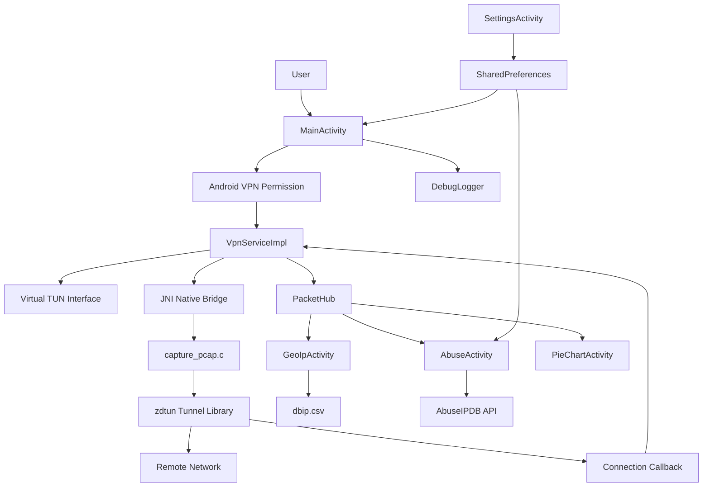
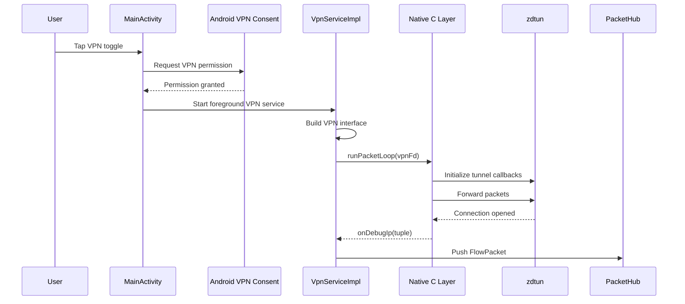
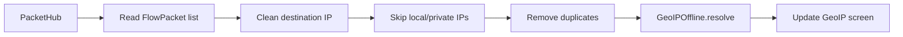
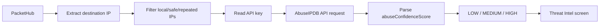

# DataDestination Project Report

## Title

**DataDestination: A Non-Root Android Network Traffic Monitoring and Destination Analysis Tool**

## Abstract

DataDestination is an Android-based network monitoring application designed to observe destination traffic metadata without requiring root access. The application uses Android's `VpnService` API to create a local VPN tunnel and routes device traffic through that tunnel. A native packet-processing layer based on `zdtun` handles packet forwarding and connection tracking, while the Java application layer stores observed destination information, performs offline GeoIP lookup, optionally checks destination reputation through AbuseIPDB, and presents the results through multiple Android screens.

The project focuses on practical mobile network visibility. Instead of capturing private packet contents for deep inspection, it primarily records connection metadata such as destination IP addresses, protocol labels, ports, timestamps, and origin. This makes the tool useful for educational analysis, basic traffic awareness, destination country mapping, and experimental threat intelligence workflows.

DataDestination is currently an experimental build. It includes a main VPN control screen, debug console, GeoIP viewer, threat checker, traffic pie chart, settings page, about page, native VPN forwarding code, and an unfinished desktop-client integration for receiving traffic data from a desktop helper.

## 1. Introduction

Modern Android applications communicate with many remote services in the background. Users often cannot easily see which destination IP addresses are contacted by their device or applications. Traditional packet capture tools frequently require root access, external hardware, or advanced configuration. Android provides a safer alternative through `VpnService`, which allows an app to create a user-approved virtual network interface and inspect routed traffic inside the app sandbox.

DataDestination uses this model to build a non-root traffic monitoring application. After the user enables the VPN, the app establishes a virtual interface, forwards packets through a native tunnel library, records connection destination data, and displays network intelligence in the user interface.

The application is named **DataDestination** because its primary goal is to show where network data is going.

## 2. Problem Statement

Android users and students studying mobile networking often need a simple way to observe outbound network destinations. However, common barriers include:

- Android devices are usually not rooted.
- Root-based packet capture can be unsafe and unsuitable for normal users.
- Full packet analysis is complex and may expose sensitive data.
- Network destination data is difficult to interpret without enrichment such as GeoIP or reputation checking.
- Most low-level capture tools are not designed as beginner-friendly Android apps.

This project addresses the problem by providing a non-root Android application that captures traffic metadata through a VPN tunnel and enriches it with destination country and threat reputation information.

## 3. Objectives

The main objectives of DataDestination are:

- To monitor Android network traffic without root access.
- To use Android `VpnService` as the traffic capture mechanism.
- To integrate a native tunnel layer using `zdtun` for packet forwarding and connection tracking.
- To collect destination IP metadata in a shared application-level packet store.
- To perform offline IP-to-country lookup using a bundled CSV database.
- To optionally classify destination IPs using AbuseIPDB.
- To present network data through readable UI screens.
- To visualize traffic distribution by country using a pie chart.
- To provide a debug mode for development and testing.
- To keep the project suitable for educational and experimental use.

## 4. Scope

### 4.1 Included Scope

The project includes:

- Android VPN setup and foreground service execution.
- Native packet loop through JNI.
- Destination tracking through `zdtun` connection callbacks.
- In-memory packet storage.
- GeoIP lookup for IPv4 and IPv6 ranges.
- AbuseIPDB API integration through a user-provided API key.
- Navigation drawer with multiple screens.
- Settings management using Android `SharedPreferences`.
- Debug console with recent log messages.
- MPAndroidChart-based country distribution chart.
- Basic desktop-client socket receiver, marked unfinished in the UI.

### 4.2 Out of Scope

The current version does not fully implement:

- Per-application traffic mapping.
- Persistent database storage of captured traffic.
- Detailed packet payload inspection.
- Full DNS/domain-name resolution display.
- Production-grade threat detection.
- Complete desktop helper workflow.
- Strong API response parsing with a JSON library.
- Automated test coverage for all modules.

## 5. Technology Stack

| Area | Technology |
|---|---|
| Platform | Android |
| Primary language | Java |
| Native language | C |
| Build system | Gradle with Android Gradle Plugin |
| Native build | CMake, Android NDK |
| Minimum SDK | 22 |
| Target SDK | 36 |
| Compile SDK | 36 |
| UI framework | Android Views, AppCompat, Material Components, ConstraintLayout |
| Charting | MPAndroidChart |
| VPN capture | Android `VpnService` |
| Native tunnel | `zdtun` |
| GeoIP source | Bundled DB-IP CSV asset |
| Threat intelligence | AbuseIPDB API |
| Storage | `SharedPreferences`, in-memory lists/maps |
| License | MIT for project code, with third-party components listed separately |

## 6. Project Structure

The important project directories are:

```text
DataDestination/
├── app/
│   ├── build.gradle
│   ├── src/main/
│   │   ├── AndroidManifest.xml
│   │   ├── assets/
│   │   │   └── dbip.csv
│   │   ├── java/com/vkmu/datadestination/
│   │   │   ├── MainActivity.java
│   │   │   ├── BaseActivity.java
│   │   │   ├── GeoIpActivity.java
│   │   │   ├── AbuseActivity.java
│   │   │   ├── PieChartActivity.java
│   │   │   ├── SettingsActivity.java
│   │   │   ├── AboutActivity.java
│   │   │   ├── connection/
│   │   │   ├── debug/
│   │   │   ├── parser/
│   │   │   ├── utils/
│   │   │   └── vpn/
│   │   ├── cpp/
│   │   │   ├── capture_pcap.c
│   │   │   ├── CMakeLists.txt
│   │   │   └── zdtun/
│   │   └── res/
│   │       ├── layout/
│   │       ├── menu/
│   │       ├── drawable/
│   │       └── values/
│   ├── proguard-rules.pro
│   └── release/
├── gradle/
│   └── libs.versions.toml
├── DesktopTools/
│   └── DesktopDataDestination.jar
├── README.md
└── LICENSE
```

## 7. System Overview

DataDestination is organized into four major layers:

1. **User Interface Layer**
   - Provides screens for controlling VPN monitoring, viewing GeoIP data, checking threats, seeing charts, changing settings, and reading project information.

2. **Application Logic Layer**
   - Stores packet metadata, performs IP cleanup, manages settings, and coordinates background threads.

3. **VPN and Native Capture Layer**
   - Uses Android `VpnService` to create a virtual network interface.
   - Uses JNI to call native C functions.
   - Uses `zdtun` to forward packets and track connections.

4. **Data Enrichment Layer**
   - Resolves destination IPs to country codes through a bundled CSV.
   - Checks destination risk through AbuseIPDB when an API key is available.

## 8. Architecture Diagram



## 9. Application Components

### 9.1 MainActivity

`MainActivity` is the home screen and main controller of the app. It performs the following tasks:

- Loads the main layout.
- Attaches the debug console to `DebugLogger`.
- Reads debug mode from `SharedPreferences`.
- Initializes the navigation drawer.
- Starts the optional desktop receiver if enabled.
- Loads GeoIP data in a background thread.
- Starts a background monitor that logs the current packet count.
- Handles the VPN toggle button.
- Requests Android VPN permission using `VpnService.prepare()`.
- Starts or stops `VpnServiceImpl`.

The VPN is not started directly without user approval. Android requires explicit consent before an app can establish a VPN profile.

### 9.2 BaseActivity

`BaseActivity` contains shared drawer-navigation logic used by most screens. It sets up:

- `DrawerLayout`
- `NavigationView`
- `MaterialToolbar`
- `ActionBarDrawerToggle`
- Navigation actions for Home, GeoIP, Threat Checker, Traffic Chart, Settings, and About

This avoids repeating drawer setup code in every activity.

### 9.3 VpnServiceImpl

`VpnServiceImpl` is the core VPN service. It extends Android's `VpnService` and runs as a foreground service while monitoring is active.

Important responsibilities:

- Creates a persistent foreground notification.
- Creates the VPN tunnel using `VpnService.Builder`.
- Assigns local VPN addresses:
  - IPv4: `10.2.2.1/30`
  - IPv6: `fd00:2:2::1/64`
- Routes all IPv4 traffic with `0.0.0.0/0`.
- Routes all IPv6 traffic with `::/0`.
- Adds DNS servers:
  - `8.8.8.8`
  - `2001:4860:4860::8888`
- Establishes the VPN interface and obtains its file descriptor.
- Starts a native packet loop in a separate thread.
- Exposes `protectSocket(int fd)` so native sockets are excluded from being routed back into the VPN.
- Receives native connection debug strings through `onDebugIp(String ip)`.
- Converts observed native connection strings into `FlowPacket` objects and pushes them into `PacketHub`.

### 9.4 Native Capture Layer

The native layer is implemented in `capture_pcap.c`. It is compiled into a shared library named `capture`, loaded by `System.loadLibrary("capture")`.

The native layer provides two JNI methods:

- `runPacketLoop(int vpnFd)`
- `stopPacketLoop()`

`runPacketLoop()` initializes `zdtun`, registers callbacks, reads packets from the VPN file descriptor, forwards packets through `zdtun`, handles socket events with `select()`, and sends packets back to the VPN interface.

Important native callbacks:

- `on_socket_open()` calls Java `protectSocket()` so sockets opened by the tunnel are protected from VPN loops.
- `on_connection_open()` converts the connection tuple to a string and sends it to Java using `onDebugIp()`.
- `send_to_vpn_interface()` writes processed packets back to the TUN interface.

This design separates high-performance packet forwarding from the Android UI and business logic.

### 9.5 zdtun

`zdtun` is a native C tunnel library used by PCAPdroid. In this project, it provides VPN-like packet forwarding without root access. It supports TCP, UDP, ICMP, IPv4, and IPv6 handling. DataDestination integrates it as a subdirectory under `app/src/main/cpp/zdtun`.

### 9.6 PacketHub

`PacketHub` is the shared in-memory packet store for the app. It keeps a synchronized list of `FlowPacket` objects and limits the list to the latest 1000 entries.

Main operations:

- `push(FlowPacket packet)` adds a packet.
- `getPackets()` returns a copy of the current packet list.

The use of synchronized methods helps avoid basic race conditions when multiple background threads read and write packet data.

### 9.7 FlowPacket

`FlowPacket` is the data model for captured traffic metadata. It contains:

- `origin`: source of the observation, such as `vpn` or `desktop`.
- `destinationIp`: destination IP or connection tuple.
- `sourcePort`: source port.
- `destinationPort`: destination port.
- `protocol`: protocol label.
- `timestamp`: capture time in milliseconds.

This model stores metadata only. It does not store full packet payloads.

### 9.8 GeoIPOffline

`GeoIPOffline` loads and searches the bundled `dbip.csv` asset. The CSV contains IP ranges and country codes.

Features:

- Loads CSV rows from app assets.
- Supports IPv4 ranges using `long`.
- Supports IPv6 ranges using `BigInteger`.
- Skips rows with country code `ZZ`.
- Sorts ranges after loading.
- Uses a cache map to avoid repeated resolution of the same IP.
- Returns country code, `Unknown`, or `Loading...`.

IPv6 lookup uses binary search. IPv4 lookup currently iterates through the IPv4 range list linearly.

### 9.9 GeoIpActivity

`GeoIpActivity` displays destination IP addresses and country codes. It repeatedly reads packets from `PacketHub`, cleans destination strings, skips local/private IP ranges, removes duplicates, resolves each destination with `GeoIPOffline`, and updates a text view.

The screen updates every two seconds in a background thread.

### 9.10 AbuseChecker

`AbuseChecker` checks IP reputation using the AbuseIPDB API. It:

- Reads the API key from `SettingsManager`.
- Sends an HTTP GET request to AbuseIPDB.
- Parses `abuseConfidenceScore` from the response.
- Converts the score into:
  - `HIGH` if score is above 75
  - `MEDIUM` if score is above 30
  - `LOW` otherwise
- Caches previous results.

The current parser is intentionally simple and does not use a full JSON parser.

### 9.11 AbuseActivity

`AbuseActivity` displays threat intelligence results. It reads IPs from `PacketHub`, filters local and known safe IPs, avoids repeated checks, limits API calls to three IPs per cycle, and groups results into:

- High-risk IPs
- All checked traffic

The screen refreshes approximately every two seconds.

### 9.12 PieChartActivity

`PieChartActivity` visualizes destination-country distribution using MPAndroidChart. It:

- Reads packets from `PacketHub`.
- Cleans destination IP values.
- Filters local/private addresses.
- Resolves destination countries using `GeoIPOffline`.
- Counts traffic per country.
- Renders a pie chart labeled "Traffic by Country".

### 9.13 SettingsActivity

`SettingsActivity` manages user-configurable values using `SharedPreferences`.

Settings include:

- AbuseIPDB API key.
- Debug mode toggle.
- Desktop client enable/disable switch.
- Desktop IP address.
- Desktop port.

The desktop client option is marked unfinished in the layout.

### 9.14 DesktopClient

`DesktopClient` is an optional socket client that connects to a configured host and port. It reads line-based destination IP data from the socket, cleans the incoming value, validates IPv4 format, and pushes it into `PacketHub` as desktop-origin traffic.

This feature appears experimental and is supported by a bundled `DesktopDataDestination.jar` file.

### 9.15 DebugLogger

`DebugLogger` provides a small in-app debug console. It:

- Attaches to a `TextView`.
- Keeps the latest 40 log lines.
- Respects the debug mode setting.
- Updates UI safely through a main-thread `Handler`.

Debug mode is useful during development because VPN and native code problems can otherwise be difficult to observe from the app interface.

## 10. Data Flow

### 10.1 VPN Capture Flow



### 10.2 GeoIP Display Flow



### 10.3 AbuseIPDB Flow



## 11. Core Algorithms

### 11.1 VPN Start Algorithm

1. User taps the toggle button.
2. App checks if Android VPN permission is required.
3. If required, Android displays the VPN permission prompt.
4. After approval, `VpnServiceImpl` is started.
5. Service creates foreground notification.
6. Service configures VPN addresses, routes, DNS, and MTU.
7. Service establishes the VPN interface.
8. Service passes the VPN file descriptor to native code.
9. Native code starts packet forwarding and connection tracking.

### 11.2 Packet Storage Algorithm

1. Native code detects an opened connection.
2. Native code sends a tuple string to Java.
3. `VpnServiceImpl.onDebugIp()` receives the string.
4. A `FlowPacket` object is created.
5. `PacketHub.push()` stores the packet.
6. If the packet list exceeds 1000 entries, the oldest entry is removed.

### 11.3 GeoIP Lookup Algorithm

1. Read `dbip.csv` from app assets.
2. For each row, parse start IP, end IP, and country.
3. Detect IPv4 or IPv6 based on the presence of `:`.
4. Convert IPv4 to `long`.
5. Convert IPv6 to `BigInteger`.
6. Store the IP range and country.
7. Sort ranges.
8. On lookup, check cache first.
9. If not cached, search the appropriate range list.
10. Return country code or `Unknown`.

### 11.4 Threat Classification Algorithm

1. Extract destination IP from traffic metadata.
2. Skip private, local, repeated, or known safe IPs.
3. Read AbuseIPDB API key.
4. Query AbuseIPDB for the destination IP.
5. Extract `abuseConfidenceScore`.
6. Classify:
   - `HIGH`: score greater than 75
   - `MEDIUM`: score greater than 30
   - `LOW`: score 30 or below
7. Store and display the result.

## 12. User Interface

### 12.1 Home Screen

The home screen contains:

- Toolbar with app name.
- Circular VPN toggle button.
- Optional debug console.
- Navigation drawer.

The toggle starts or stops VPN monitoring.

### 12.2 Navigation Drawer

The drawer provides access to:

- Home
- GeoIP
- Threat Checker
- Traffic Chart
- Settings
- About

### 12.3 GeoIP Viewer

Displays cleaned destination IPs with their resolved country codes.

### 12.4 Threat Intel Screen

Displays AbuseIPDB classification results. High-risk IPs are separated from general traffic results.

### 12.5 Traffic Chart

Displays a pie chart showing traffic distribution by destination country.

### 12.6 Settings Screen

Allows the user to configure:

- API key
- Debug mode
- Desktop client status
- Desktop IP
- Desktop port

### 12.7 About Screen

Displays project description, disclaimer, license information, third-party resources, and author information.

## 13. Android Permissions and Security Model

The manifest declares:

- `INTERNET`
- `FOREGROUND_SERVICE`
- `FOREGROUND_SERVICE_DATA_SYNC`
- `BIND_VPN_SERVICE` for the VPN service

`BIND_VPN_SERVICE` is used on the service declaration and ensures that Android treats it as a VPN service. The user must approve the VPN connection before traffic can be routed through the app.

The app runs the VPN as a foreground service because Android requires long-running background services to show a persistent notification.

## 14. Privacy and Ethics

DataDestination observes network destination metadata. Even when packet payloads are not stored, destination IPs can still reveal sensitive behavior. For this reason:

- The app should be used only on devices and networks where the user has permission.
- The project should be treated as educational and experimental.
- Captured metadata should not be shared without consent.
- AbuseIPDB results should not be treated as final proof of malicious activity.
- The app disclaimer correctly states that results may be inaccurate or incomplete.

## 15. Testing

The project currently contains default Android test files:

- `ExampleUnitTest`
- `ExampleInstrumentedTest`

Existing tests verify only basic template behavior, such as arithmetic and package name. For a stronger project report and future development, the following tests are recommended:

| Test Area | Suggested Test |
|---|---|
| GeoIP conversion | Test `ipToLong()` with known IPv4 values |
| GeoIP lookup | Verify known public IP ranges resolve correctly |
| PacketHub | Verify max size limit of 1000 entries |
| Packet parser | Test IPv4, UDP, source port, destination port parsing |
| Abuse parser | Test LOW, MEDIUM, HIGH classification from sample JSON |
| Settings | Verify API key and toggles persist correctly |
| UI navigation | Verify drawer navigation opens correct screens |
| VPN lifecycle | Verify start/stop actions do not crash |

## 16. Build and Run Procedure

### 16.1 Requirements

- Android Studio
- Android SDK 36
- Android NDK version `29.0.14206865`
- CMake
- Gradle wrapper included in the project
- Android device or emulator
- Internet connection for AbuseIPDB lookup

### 16.2 Build Steps

1. Open the project in Android Studio.
2. Allow Gradle sync to complete.
3. Ensure the required NDK and CMake versions are installed.
4. Build the app using Android Studio or Gradle.
5. Install the APK on a device or emulator.
6. Launch DataDestination.
7. Tap the VPN toggle and approve the Android VPN prompt.

### 16.3 Optional Threat Checking

1. Create or obtain an AbuseIPDB API key.
2. Open the Settings screen.
3. Enter the API key.
4. Open the Threat Checker screen.
5. Start VPN monitoring and observe results.

## 17. Limitations

The current implementation has several limitations:

- GeoIP IPv4 lookup uses linear scanning, which may become slow for large datasets.
- AbuseIPDB response parsing uses manual string operations instead of a JSON parser.
- API keys are stored in `SharedPreferences` without encryption.
- Packet data is stored only in memory and is lost when the app process is killed.
- Some background loops run continuously and could be optimized with lifecycle-aware components.
- The desktop client feature is marked unfinished.
- Threat scoring depends on external API availability and rate limits.
- The chart loads data once when the screen opens and does not continuously refresh.
- The app does not map traffic to individual Android app package names.
- Native memory/resource cleanup should be reviewed carefully before production use.

## 18. Future Enhancements

Possible future improvements include:

- Add Room database storage for traffic history.
- Add app/package-name attribution using Android UID mapping.
- Add domain-name display through DNS parsing.
- Replace manual AbuseIPDB parsing with a JSON library.
- Encrypt stored API keys using Android Keystore.
- Add search and filters for IPs, countries, ports, and protocols.
- Add live chart refresh.
- Add export options such as CSV or JSON.
- Add unit tests for packet parsing, GeoIP, and threat classification.
- Add better lifecycle handling for activity background threads.
- Add notification controls for stopping VPN directly.
- Complete and document the desktop helper integration.
- Add country names instead of only country codes.
- Add user controls to exclude private IP ranges or selected apps.

## 19. Conclusion

DataDestination demonstrates how Android network traffic metadata can be monitored without root access by combining `VpnService`, JNI, and the `zdtun` native tunnel library. The project successfully establishes a VPN-based monitoring path, records destination information, enriches IPs through offline GeoIP lookup and optional AbuseIPDB checks, and presents the information through a multi-screen Android interface.

The project is especially valuable as an educational prototype because it connects several important Android and networking concepts: foreground services, VPN interfaces, native libraries, packet forwarding, JNI callbacks, shared data stores, API-based enrichment, and mobile UI visualization. Although the current version is experimental and has clear limitations, it provides a solid foundation for a more complete Android traffic intelligence tool.

## 20. References

- Android `VpnService` documentation
- Android foreground service documentation
- Android NDK and CMake documentation
- zdtun library included in `app/src/main/cpp/zdtun`
- PCAPdroid project concepts referenced in project files
- DB-IP geolocation data: https://db-ip.com
- AbuseIPDB API: https://abuseipdb.com
- MPAndroidChart library
- Project source files in `com.vkmu.datadestination`

